# OpenFasoc   
Fully-Autonomous SoC Synthesis using Customizable Cell-Based Synthesizable Analog Circuits.
The SoC synthesis tool realizes analog circuits, including PLLs, power management, ADCs, and sensor interfaces by recasting them as structures composed largely of digital components while maintaining analog performance. 
OpenFASOC is focused on open-source automate analog generation from user specification to GDSII with fully open-sourced tools. This project is led by a team of researchers at the University of Michigan is inspired from FASoC whcih sits on proprietary tools.
See more about FaSoC at https://fasoc.engin.umich.edu/    also at https://openfasoc.readthedocs.io/en/latest/index.html   

# Installation   

## Openfasoc   
The command used to install OpenFASOC are    
```
git clone https://github.com/idea-fasoc/openfasoc

cd openfasoc

pip install -r requirements.txt
```   
## Prerequisites   

 ### 1.OpenROAD   
The commands to install OpenROAD are,
```
git clone --recursive https://github.com/The-OpenROAD-Project/OpenROAD.git

cd OpenROAD

./etc/DependencyInstaller.sh

./etc/DependencyInstaller.sh -run

./etc/DependencyInstaller.sh -dev

mkdir build

cd build

sudo cmake ..

sudo make
```    
 ### 2. Open_PDKs   
 
 we need sky130A files   
 
 download from http://opencircuitdesign.com/open_pdks/archive/open_pdks-1.0.354.tgz    
 
 or git clone https://github.com/RTimothyEdwards/open_pdks    
 
 or git clone git://opencircuitdesign.com/open_pdks   
 ```   
 ./configure --enable-sky130-pdk
sudo make
sudo make install   
```   
you may need some prerequisites for this clone them from opencircuitdesign.com/open_pdks     

 ### 3. Klayout
 we need laytest version.
Downlaod the latest version of the Klayout from [here](https://www.klayout.de/build.html). Install the following dependencies: qt5-default, qttools5-dev, libqt5xmlpatterns5-dev, qtmultimedia5-dev, libqt5multimediawidgets5 and libqt5svg5-dev.   
```
sudo apt-get install -y libqt5widgets5

sudo dpkg -i klayout_0.27.11-1_amd64.deb

````    
### 4. Netgen  
download http://opencircuitdesign.com/netgen/archive/netgen-1.5.241.tgz   
commands for installation   
```   
./configure
make
make install   
```   
### 5. magic   
download from http://opencircuitdesign.com/magic/archive/magic-8.3.335.tgz 
```  
./configure
make
make install   
```   
### 6. yosys   
The software used to run gate level synthesis. Yosys is a framework for Verilog RTL synthesis.
To install yosys, install the prerequisites using the following command 
 ```
 sudo apt-get install build-essential clang bison flex \
	libreadline-dev gawk tcl-dev libffi-dev git \
	graphviz xdot pkg-config python3 libboost-system-dev \
	libboost-python-dev libboost-filesystem-dev zlib1g-dev
```
To install latest Version of Yosys, 
```
git clone https://github.com/YosysHQ/yosys.git

make

sudo make install 

make test

```   
## Run Openfasoc Flow   

before that-

1.  cd into the directory where the OpenFASoC repository was cloned;

    Now edit the openfasoc/common/platform_config.json file, replacing the open_pdks value with the path to the sky130A/ directory from open_pdks;
    
2. copy  /home/sritam/OpenFasoc/openfasoc/OpenROAD/build/src/openroad  /home/sritam/OpenFasoc/openfasoc/generators/temp-sense-gen/tools/install/OpenROAD/bin/openroad

3. edit /OpenFasoc/openfasoc/generators/temp-sense-gen/flow/Makefile at line 657 python to python3.9 or python3.8 which is present at your computer/bin/ 

4. edit /OpenFasoc/openfasoc/generators/temp-sense-gen/flow/Makefile , insert a line at 167 export OPENROAD_EXE = /home/sritam/OpenFasoc/openfasoc/generators/temp-sense-gen/tools/install/OpenROAD/bin/openroad


After that   

run flow-  

<p align="center">   
  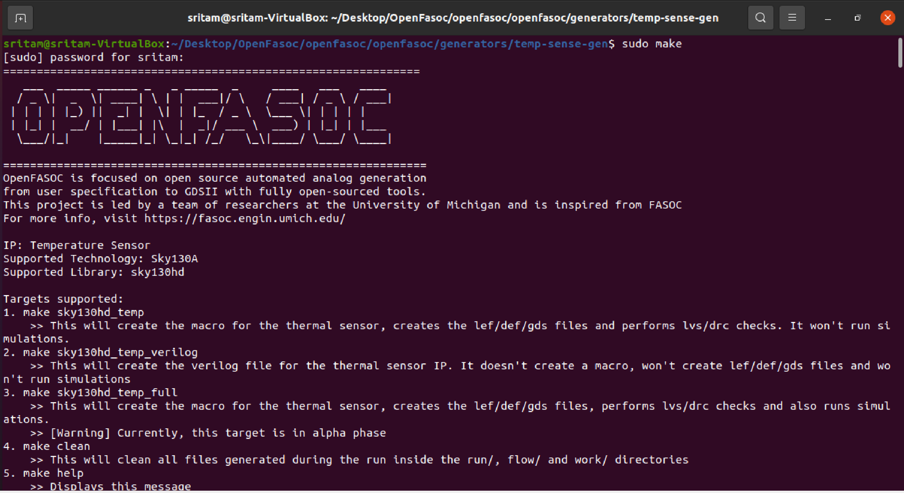
</p><br>    

The generator references the model files in an iterative process until either meeting specifications or failing.     
the tool is trying to minimize the error iteratively, by varying the number of inverters and headers for the given temperature range.   

<p align="center">   
  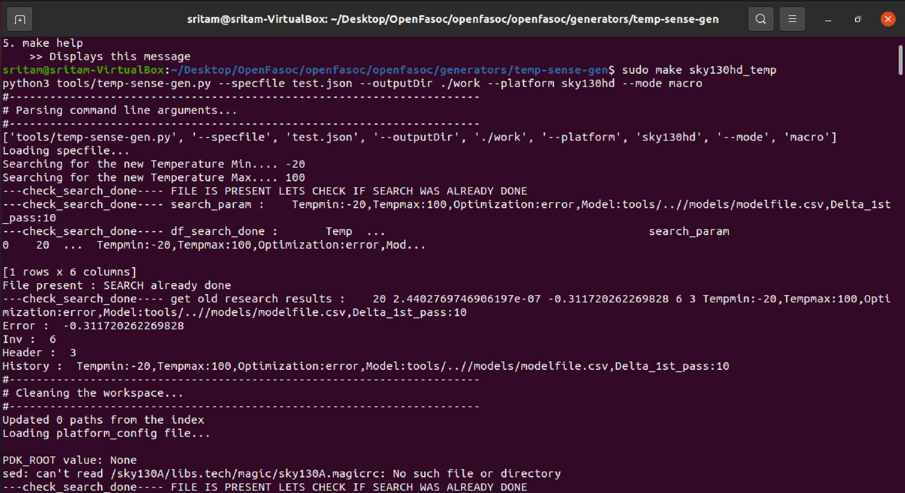
</p><br>    

after the flow completed you get    
<p align="center">   
  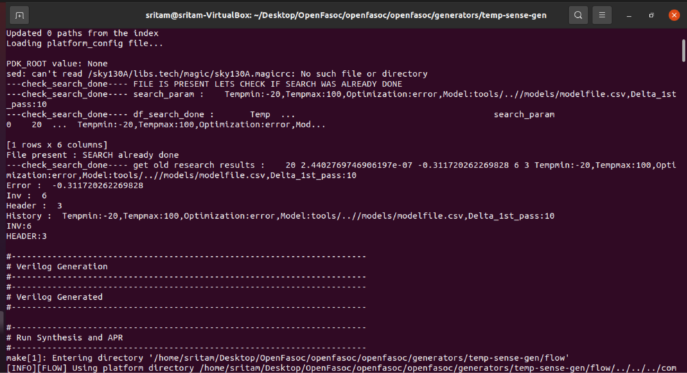
</p><br>    

<p align="center">   
  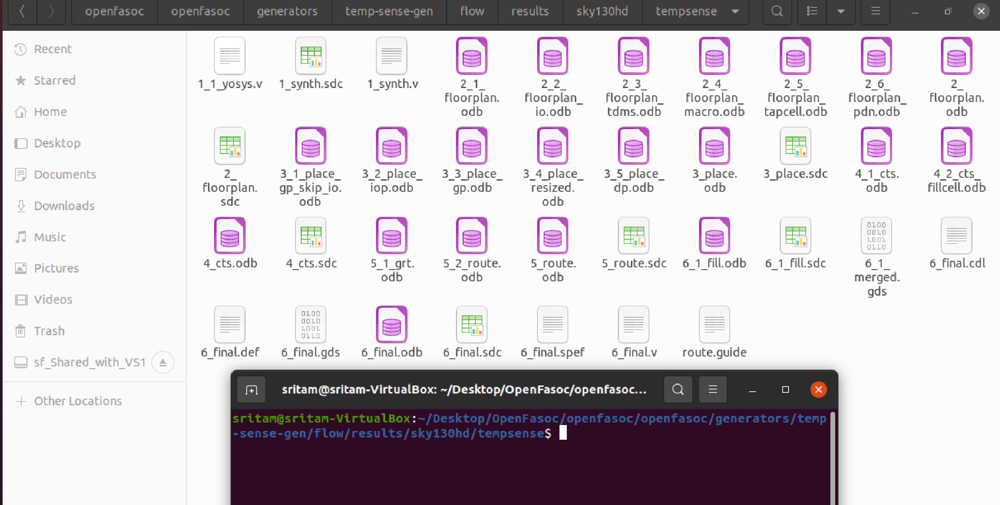
</p><br>    

klayout view of 6_final.gds   

<p align="center">   
  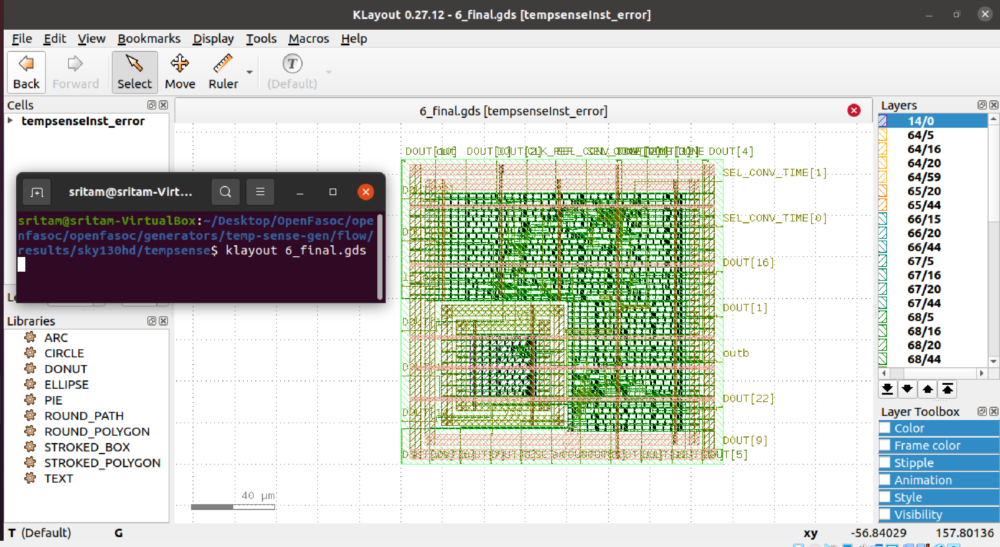
</p><br>    


## Temperature Sensor Generator   

Circuit   
-------
This generator creates a compact mixed-signal temperature sensor based on the topology from this [paper](https://ieeexplore.ieee.org/document/9816083).   

It consists of a ring oscillator whose frequency is controlled by the voltage drop over a MOSFET operating in subthreshold regime, where its dependency on temperature is exponential.   

    

### OpenFASOC Flow
<p align="center">
  
</p><br>   


The steps from the RTL-to-GDS flow look like this, usual in a digital flow:   
<p align="center">   
  
</p><br>    

<p align="center">   
  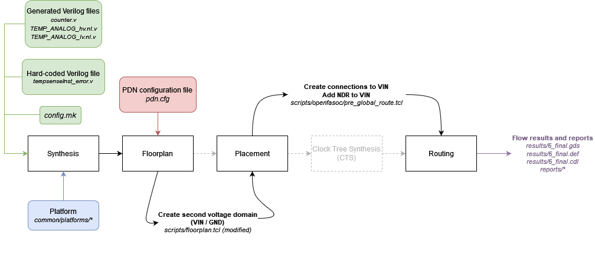
</p><br>    


```   
temp-sense-gen
├── blocks
└── flow
    └── design
        ├── sky130hd
        │   └── tempsense
        │       ├── config.mk             <--
        │       └── constraint.sdc
        └── src
            └── tempsense
                ├── counter.v             <--
                ├── TEMP_ANALOG_hv.nl.v   <--
                ├── TEMP_ANALOG_lv.nl.v   <--
                ├── TEMP_AUTO_def.v       <--
                └── tempsenseInst_error.v <--
```    
The default circuit’s physical design generation can be divided into three parts:

 1. Verilog generation     

 2. RTL-to-GDS flow (OpenROAD)     

 3. Post-layout verification (DRC and LVS)     

### Verilog generation   

Running make sky130hd_temp (temp for “temperature sensor”) executes the temp-sense-gen.py script from temp-sense-gen/tools/. This file takes the input specifications from test.json and outputs Verilog files containing the description of the circuit.

The generator starts from a Verilog template of the temperature sensor circuit, located in temp-sense-gen/src/. The .v template files have lines marked with @@, which are replaced according to the specifications.  

templetes -

1.TEMP_ANALOG_hv.v      
2.TEMP_ANALOG_lv.v     
3.counter_generic.v     

using this generated files-     

1.TEMP_ANALOG_hv.nl.v    
2.TEMP_ANALOG_lv.nl.v    
3.counter.v    

<p align="center">   
  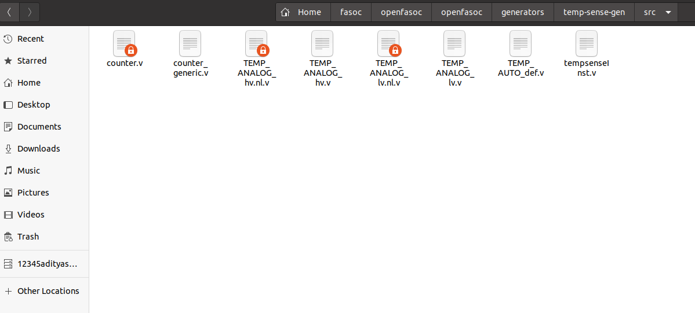
</p><br>   


 #### what are hv lv file do-   
 
   they are part of temperature sensor circuits.   
   
   #### HV FILE   


User Specs    

Temperature sensing range: -20⁰C – 125⁰C    

Frequency range of operation: 100Hz – 10MHz    

* Inputs

1. CLK_REF: System clock taken from input.

2. RESET_COUNTERn: Input signal to reset the module initial state.

3. SEL_CONV_TIME: Four bit input used to select how many times the 1 bit of the output DOUT is fractionated (0-16).

* Outputs

1. DOUT: The output voltage whose frequency is dependent on temperature.

2. DONE: Validity signal for DOUT

Theses are the verilog template files which are used for the creation of netlist verilog files.    

We use an all-digital temperature sensor architecture, that relies on a new subthreshold oscillator (achieved using the auxiliary cell “Header Cell“) for realizing synthesizable thermal sensors. We choose frequency as the temperature dependent variable. So, we use a ring oscillators that is based on inverters only and stacked native IO devices for better line sensitivity.    
Since the subthreshold current has an exponential dependency on the temperature, the frequency generated from the subthreshold ring oscillator is also dependent on temperature. Using this principle, we can sense the temperature by comparing the clock generated from a reference oscillator and the clock frequency from our proposed frequency generator.

# AUX CELL GENERATION FOR - OpenFASoC(Fully Open-Source Autonomous SoC)


## GENERATING .lef, .gds for Aux cells

**Discription** : In Open FASoC Flow to generate a automated Analog design, few auxilaury cells(.lef,.gds) are required to be created which cannot be implemented with existing library cells (like Header and SLC in temp_sence_gen). To generate these .lef and .gds files of AUX cells we use ALIGN.

### Reduired inputs from previous step of flow:
 - SCHEMATIC and SPECIFICATION of AUX cell to be generated.
(usually AUX cell contains 6 to 12 transistors)

### First Step 

- Depending upon given SCHEMATIC and SPECIFICATION of AUX cell, a SPICE Netlist will be created with .sp file extension.

### Using ALIGN: Analog Layout, Intelligently Generated from Netlists:

**About:**

ALIGN is an open source automatic layout generator for analog circuits jointly developed under the DARPA IDEA program by the University of Minnesota, Texas A&M University, and Intel Corporation.

The goal of ALIGN (Analog Layout, Intelligently Generated from Netlists) is to automatically translate an unannotated (or partially annotated) SPICE netlist of an analog circuit to a GDSII layout. The repository also releases a set of analog circuit designs.

The ALIGN flow includes the following steps:

Circuit annotation creates a multilevel hierarchical representation of the input netlist. This representation is used to implement the circuit layout in using a hierarchical manner.
Design rule abstraction creates a compact JSON-format represetation of the design rules in a PDK. This repository provides a mock PDK based on a FinFET technology (where the parameters are based on published data). These design rules are used to guide the layout and ensure DRC-correctness.
Primitive cell generation works with primitives, i.e., blocks at the lowest level of design hierarchy, and generates their layouts. Primitives typically contain a small number of transistor structures (each of which may be implemented using multiple fins and/or fingers). A parameterized instance of a primitive is automatically translated to a GDSII layout in this step.
Placement and routing performs block assembly of the hierarchical blocks in the netlist and routes connections between these blocks, while obeying a set of analog layout constraints. At the end of this step, the translation of the input SPICE netlist to a GDSII layout is complete.

#### Installing ALIGN:
**Prerequisites**

- gcc >= 6.1.0 (For C++14 support)
- python >= 3.7 

Use the following commands to install ALIGN tool.

```
export CC=/usr/bin/gcc
export CXX=/usr/bin/g++
git clone https://github.com/ALIGN-analoglayout/ALIGN-public
cd ALIGN-public

#Create a Python virtualenv
python -m venv general
source general/bin/activate
python -m pip install pip --upgrade

# Install ALIGN as a USER
pip install -v .

# Install ALIGN as a DEVELOPER
pip install -e .

pip install setuptools wheel pybind11 scikit-build cmake ninja
pip install -v -e .[test] --no-build-isolation
pip install -v --no-build-isolation -e . --no-deps --install-option='-DBUILD_TESTING=ON'
```

#### Making ALIGN Portable to Sky130 tehnology

Clone the following Repository inside ALIGN-public directory

```
git clone https://github.com/ALIGN-analoglayout/ALIGN-pdk-sky130
```

move `SKY130_PDK` folder to `/home/ritesh/Documents/GitHub/OpenFASoC/AUXCELL/ALIGN-public/pdks`

#### Running ALIGN TOOL

Everytime we start running tool in new terminal run following commands.

```
python -m venv general
source general/bin/activate
```
Commands to run ALIGN (goto ALIGN-public directory)


```
mkdir work
cd work
```
General syntax to give inputs
```
schematic2layout.py <NETLIST_DIR> -p <PDK_DIR> -c
```

#### FLOW

Creating a Python virtualenv

![PYTHON]
<p align="center">   
  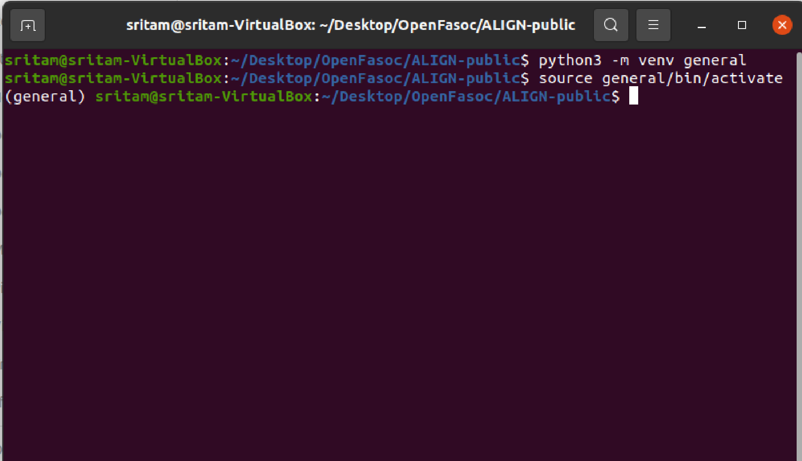
</p><br>   


Running design

![ALIGN1]
<p align="center">   
  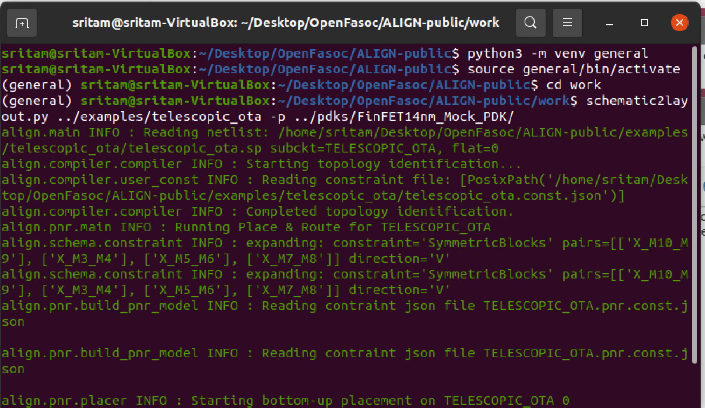
</p><br>   


![ALIGN2]
<p align="center">   
  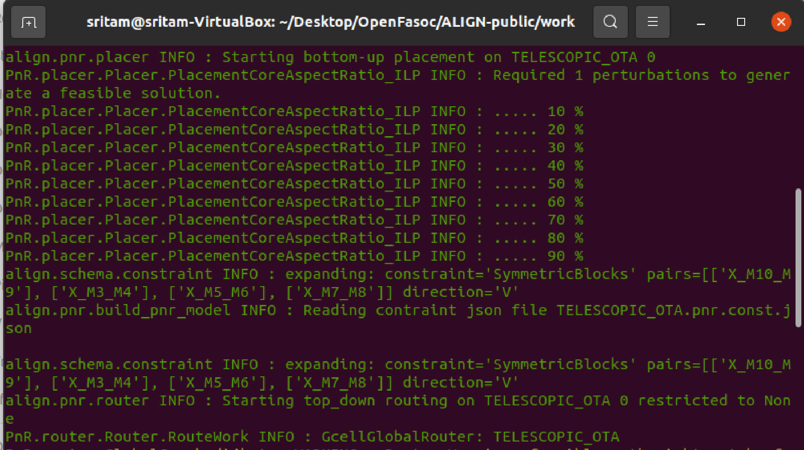
</p><br>   

#### Generated .lef and .gds

# GDS

![GDS]
<p align="center">   
  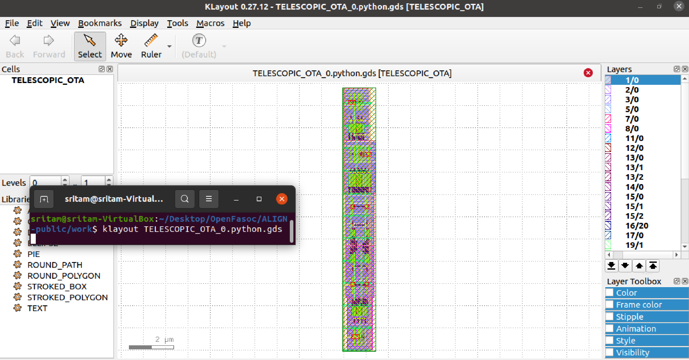
</p><br>   

# LEF
![LEF]
<p align="center">   
  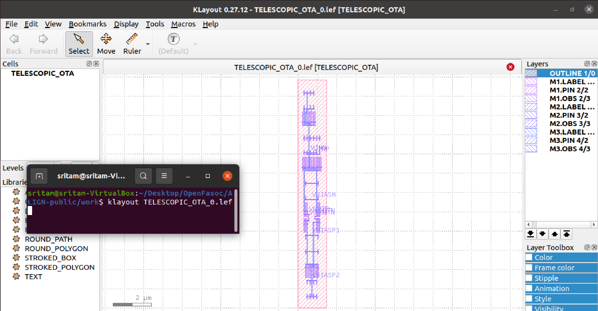
</p><br>   
## Acknowledgement
  
  * Kunal Ghosh, Director, VSD Corp. Pvt. Ltd.
  * Madhav Rao, Professor, IIIT-Bangalore.
  * Nanditha Rao, Professor, IIIT-Bangalore.
  

## Contact Information

  * Sriman Sritam Birtia, Post Graduate student, IIIT Bangalore, Sriman.Birtia@iiitb.ac.in
  * Kunal Ghosh, Director, VSD Corp. Pvt. Ltd. kunalghosh@gmail.com
  * Madhav Rao, Professor, IIIT-Bangalore. mr@iiitb.ac.in
  * Nanditha Rao, Professor, IIIT-Bangalore. nanditha.rao@iiitb.ac.in
   


